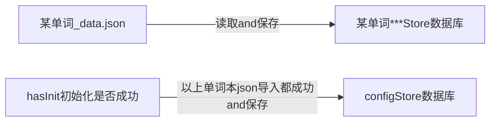
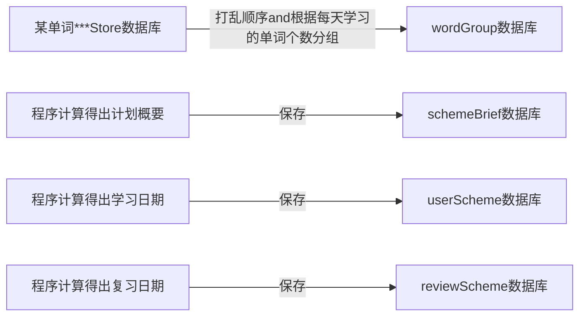
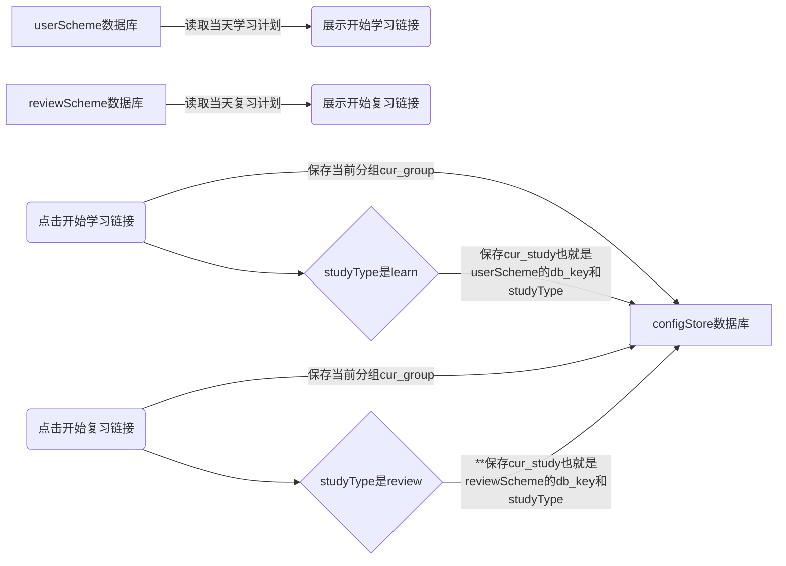
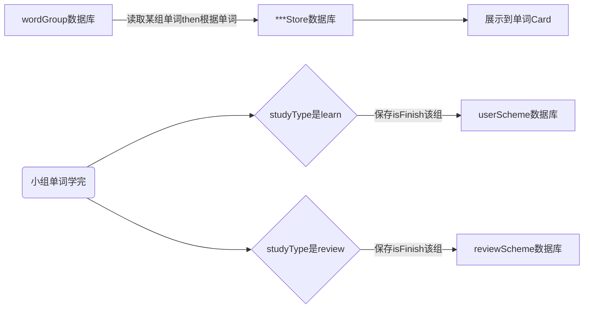
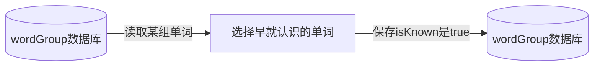
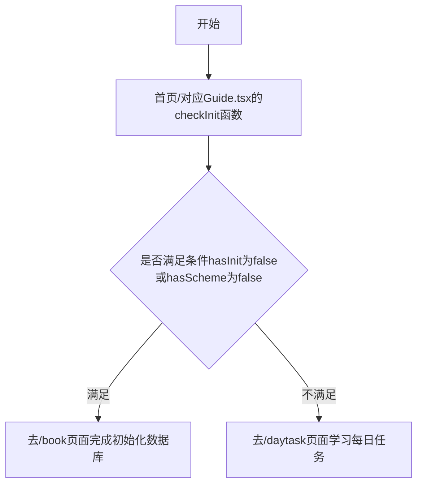
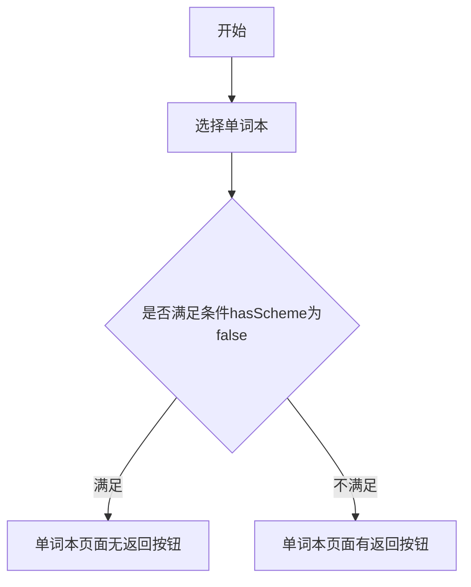
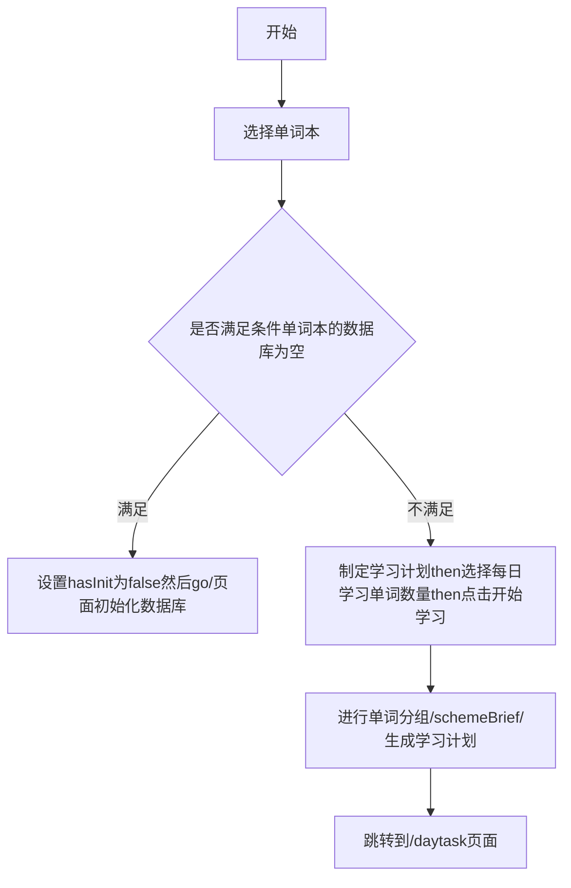
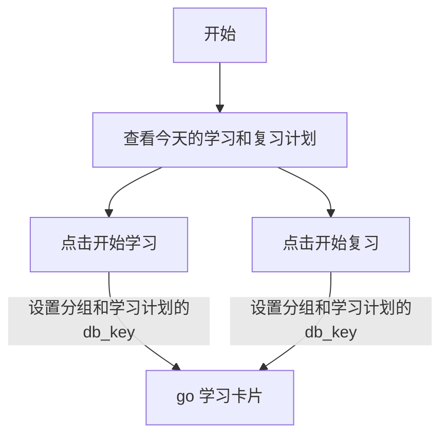
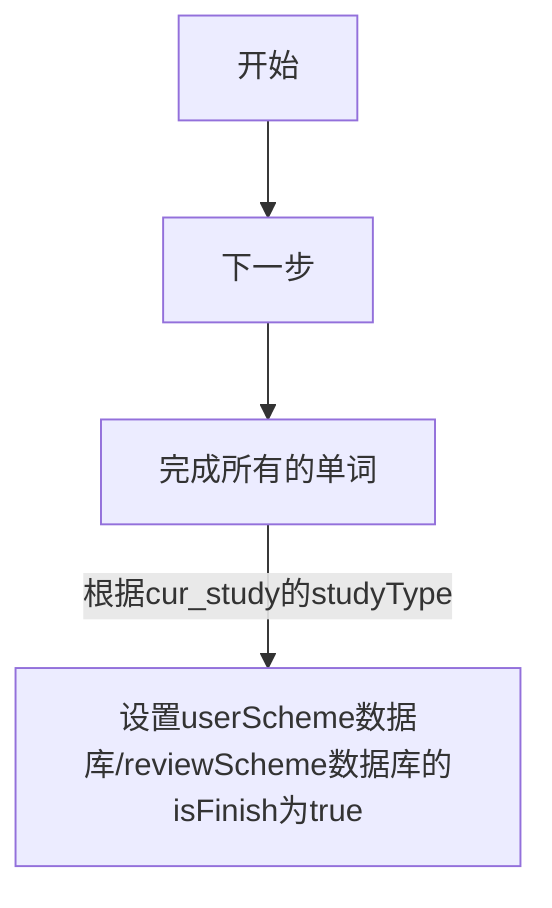

# 科学的记忆方法背单词

不用费力死记硬背，跟着APP的规划走流程就记住单词了。

## 业务流程图：用户怎么用

1、建立学习计划：选择单词本，根据选择的每天学习单词量，制定学习计划，自动计算出每天学习和复习的内容。
2、学习日程页面：有今天的学习和复习的任务，点击开始学习，进入学习卡片。
3、学习卡片页面：在首次学习时，点击右上角的筛选按钮，可以选择已经认识的单词，今后就不会出现在学习中。`学习过程中认识的单词不要筛选，因为这些刚认识的单词需要学习和复习进行加强记忆。`
4、学习卡片页面，点击下一步，进入下个单词的学习卡片。学到最后一个就学完了这次任务。
5、学习日程页面：上部有设置菜单，点击进入设置
6、设置页面：可以设置声音开关，关闭声音时，学习卡片不会自动朗读单词发音。
7、设置页面：可以重置或新建学习计划。点击重置学习计划，会进入选择单词本页面，可以制定新的学习计划。

## 数据流程图：数据从哪里来、到哪里去 `数据流图 = 数据的 “人生轨迹”，从出生 → 加工 → 存储 → 使用 → 消失。`

//-保存者全局设置的信息-比如：是否初始化-是否有学习计划-声音开关是否打开

### 初始化单词本：

### 生成学习计划：

### 每日学习任务：

### 学习单词过程：

### 筛选单词过程：

## 程序流程图：代码先跑哪、在跑哪

### 软件初始化

### 单词表页面的返回按钮展示

### 学习计划生成

### 每日学习任务

### 学习卡片

